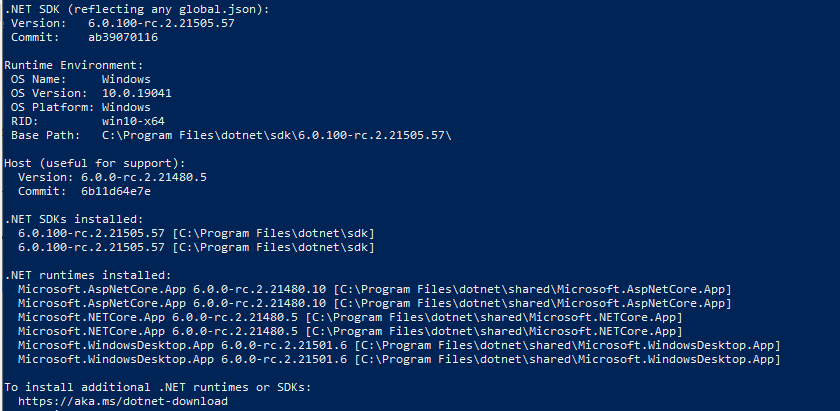
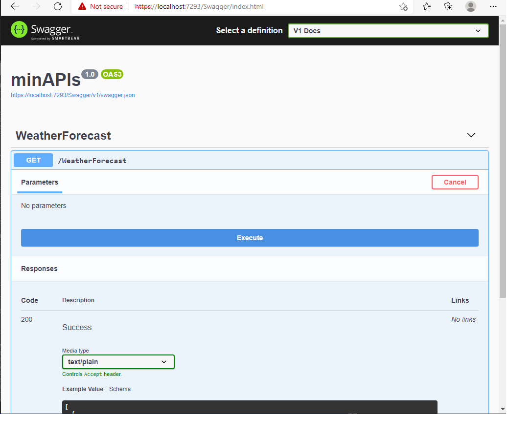
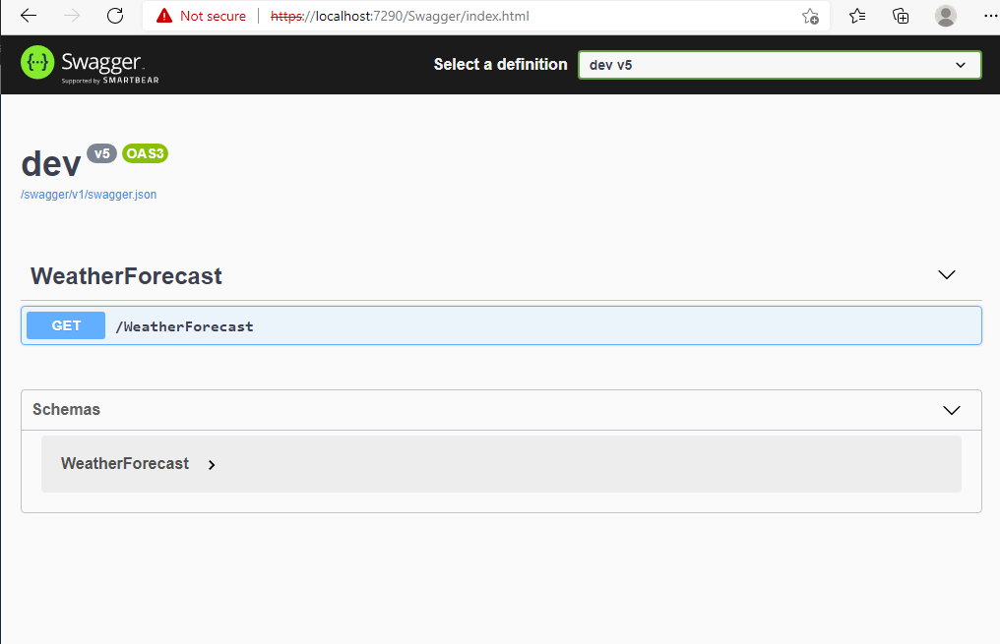
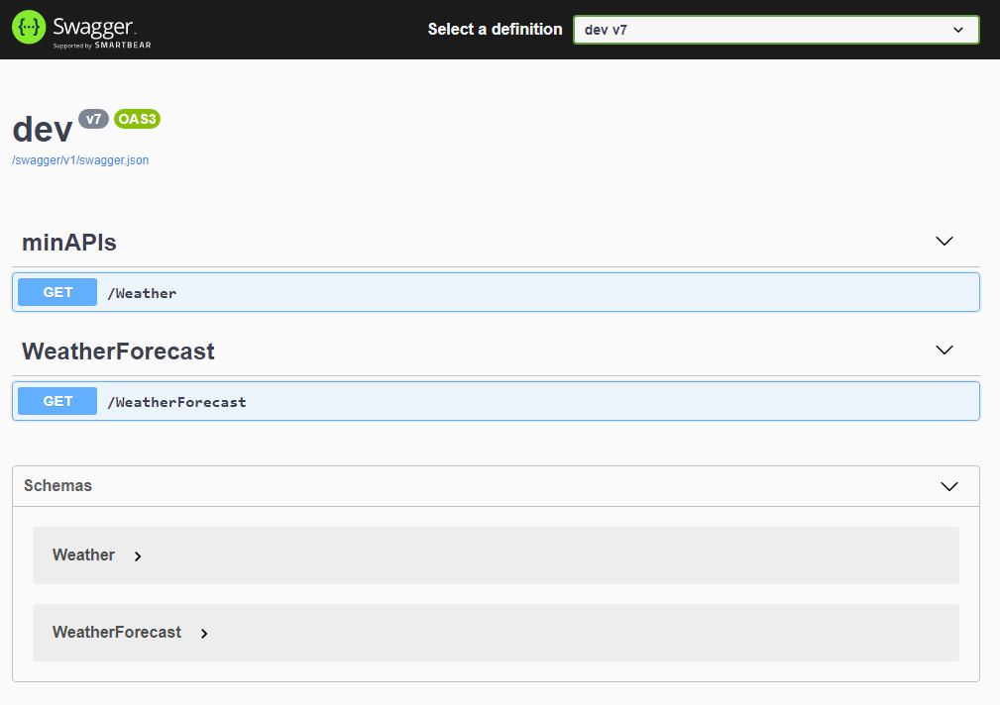

# Dot Net 6.0 - Mini WebApi

With DotNet 6.0 and C# 10, you can create a mini webapi  and minimize them even more using extensions

In this guide you can reduce the creation of the WebApi following the next steps

## Creating the DotNet WebApi with C#

To do that you need install DotNet 6.0 SDK, when you had done this, you can review the dotnet version:
```powershell
dotnet --info
```

the answer must be same to this:



The content of the new webapi files is similar to next list:

+ controllers
  + WeatherForecastController.cs
+ Program.cs
+ WeatherForecastController.cs

The files are describe to show something like this:

```c#
// WeatherForecastController.cs 
using Microsoft.AspNetCore.Mvc;

namespace minAPIs.Controllers;

[ApiController]
[Route("[controller]")]
public class WeatherForecastController : ControllerBase
{
    private static readonly string[] Summaries = new[]
    {
        "Freezing", "Bracing", "Chilly", "Cool", "Mild", "Warm", "Balmy", "Hot", "Sweltering", "Scorching"
    };

    private readonly ILogger<WeatherForecastController> _logger;

    public WeatherForecastController(ILogger<WeatherForecastController> logger)
    {
        _logger = logger;
    }

    [HttpGet(Name = "GetWeatherForecast")]
    public IEnumerable<WeatherForecast> Get()
    {
        return Enumerable.Range(1, 5).Select(index => new WeatherForecast
        {
            Date = DateTime.Now.AddDays(index),
            TemperatureC = Random.Shared.Next(-20, 55),
            Summary = Summaries[Random.Shared.Next(Summaries.Length)]
        })
        .ToArray();
    }
}
```


```c#
/// Program.cs
var builder = WebApplication.CreateBuilder(args);

// Add services to the container.

builder.Services.AddControllers();
// Learn more about configuring Swagger/OpenAPI at https://aka.ms/aspnetcore/swashbuckle
builder.Services.AddEndpointsApiExplorer();
builder.Services.AddSwaggerGen();

var app = builder.Build();

// Configure the HTTP request pipeline.
if (app.Environment.IsDevelopment())
{
    app.UseSwagger();
    app.UseSwaggerUI();
}

app.UseHttpsRedirection();

app.UseAuthorization();

app.MapControllers();

app.Run();
```

If we  run the application the result is something like this:



Now we are going to do some changes to show the use of extensions:

First create a class ```BuilderExtensions.cs``` looks something like this:

```c#
using Microsoft.OpenApi.Models;

namespace minAPIs.Extensions
{
    public static class BuilderExtension
    {
        public static WebApplicationBuilder IocContainer(this WebApplicationBuilder builder,string title,string version)
        {
            builder.Services.AddControllers();
            builder.Services.AddEndpointsApiExplorer();
            builder.Services.AddSwaggerGen(c =>
            {
                c.SwaggerDoc("v1", new OpenApiInfo { Title=title,Version=version });
            });
            return builder;
        }
    }
}
```

Note we passed the values of ```Program.cs``` to ```BuilderExtensions.cs```, and using the **this** keywordin the parameter signature at **WebApplicationBuilder** class.

Also we had added two extra arguments to pass the values of **swagger** documentation: title and version.

In ```Program.cs``` we change the code migth looks something like this:

```c#
/// Program.cs
using minAPIs.Extensions;

var builder = WebApplication.CreateBuilder(args);
builder.IoContainer("dev","v5");
var app = builder.Build();

// Configure the HTTP request pipeline.
if (app.Environment.IsDevelopment())
{
    app.UseSwagger();
    app.UseSwaggerUI();
}

app.UseHttpsRedirection();

app.UseAuthorization();

app.MapControllers();

app.Run();
```


Next we can continue with a reduction of Program.cs adding the second extension class ```AppExtensions.cs```

```c#
namespace minAPIs.Extensions
{
    public static class AppExtensions
    {
        public static WebApplication AppMiddleware(this WebApplication app,string swaggerDefinition)
        {
            // Configure the HTTP request pipeline.
            if (app.Environment.IsDevelopment())
            {
                app.UseSwagger();
                app.UseSwaggerUI(c => c.SwaggerEndpoint("/swagger/v1/swagger.json", swaggerDefinition));
            }
            app.UseHttpsRedirection();
            app.UseAuthorization();
            app.MapControllers();
            app.Run();
            return app;
        }
    }
}
```

And the changes in ```Program.cs``` and the result is looks something like this:

 ```c#
 /// Program.cs
 using minAPIs.Extensions;
 
 var builder = WebApplication.CreateBuilder(args);
 builder.IoContainer("dev","v5");
 var app = builder.Build();
 app.AppMidleware("dev v5");
 ```

Finally we can reduce the simple expression and the program file migth look something like this:

```c#
/// Program.cs
using minAPIs.Extensions;

var title = "dev";
var version = "v5" ;

var builder = WebApplication
  .CreateBuilder(args)
  .IocContainer(title,version)
  .Build()
  .AppMiddleware($"{title} {version}");
```

When you execute the application the web page is shown like this:



# Adding a Second method minimize the controller call

```c#
/// Program.cs
using minAPIs.Extensions;
var title = "dev";
var version = "v6" ;

var summaries = new[]
    {
        "Freezing", "Bracing", "Chilly", "Cool", "Mild", "Warm", "Balmy", "Hot", "Sweltering", "Scorching"
    };


var builder = WebApplication.CreateBuilder(args).
  IocContainer(title, version);
var app = builder.Build();
app.MapGet("/Weather", () =>
 {
     var forescast = Enumerable.Range(1, 5).Select(index =>
     new Weather
     (
         DateTime.Now.AddDays(index),
         Random.Shared.Next(-20, 55),
         summaries[Random.Shared.Next(summaries.Length)]
     ))
     .ToArray();
     return forescast;
 })
.WithName("GetWeather");
app.AppMiddleware($"{title} {version}");

internal record Weather (DateTime Data, int TemperatureC, string? Summary)
{
    public int TemperaturaF => 32 + (int)(TemperatureC / 0.5556);
}
```

And if you create a new extension class ```RESTMethods.cs``` and putting all separte in this class:

```c#
namespace minAPIs.Extensions
{
    public static class RESTMethods
    {
        public static WebApplication GetMethods(this WebApplication app)
        {
            var summaries = new[]
                {
                    "Freezing", "Bracing", "Chilly", "Cool", "Mild", "Warm", "Balmy", "Hot", "Sweltering", "Scorching"
                };
            app.MapGet("/Weather", () =>
            {
                var forescast = Enumerable.Range(1, 5).Select(index =>
                new Weather
                (
                    DateTime.Now.AddDays(index),
                    Random.Shared.Next(-20, 55),
                    summaries[Random.Shared.Next(summaries.Length)]
                ))
                .ToArray();
                return forescast;
            })
            .WithName("GetWeather");
            app.Run();
            return app;
        }
        internal record Weather(DateTime Data, int TemperatureC, string? Summary)
        {
            public int TemperaturaF => 32 + (int)(TemperatureC / 0.5556);
        }
    }
}
```

and change the ```Program.cs``` migth look something like this:

```c#
using minAPIs.Extensions;
var title = "dev";
var version = "v7" ;
var builder = WebApplication.CreateBuilder(args)
    .IocContainer(title, version)
    .Build()
    .AppMiddleware($"{title} {version}")
    .GetMethods();
builder.Run();
```



